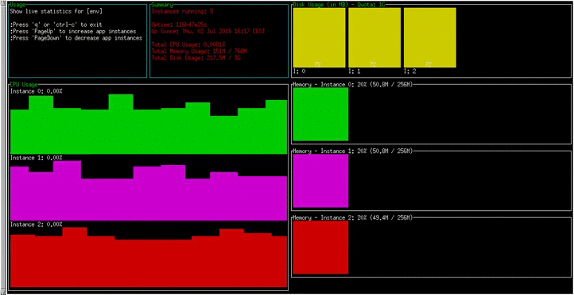

# Cloud Foundry CLI Statistics Plugin
CloudFoundry CLI plugin for displaying real-time metrics and statistics data

This plugin displays a terminal dashboard showing current app usage metrics/statistics.
It can also stream these metrics as JSON formatted output to stdout.

[](screencast.webm)

## Installation

#### Install from CLI (v.6.10.0 and up)
```
$ cf add-plugin-repo CF-Community http://plugins.cloudfoundry.org/
$ cf install-plugin Statistics -r CF-Community
```
  
#### Install from binary
- Download the appropriate plugin binary from [releases](https://github.com/swisscom/cf-statistics-plugin/releases)
- Install the plugin: `$ cf install-plugin <binary>`

#### Install from Source
```
$ go get github.com/swisscom/cf-statistics-plugin
$ cf install-plugin $GOPATH/bin/cf-statistics-plugin
```

## Usage

```
$ cf statistics APP_NAME
```

## Uninstall

```
$ cf uninstall-plugin Statistics
```

## Commands

| command/option | usage | description|
| :--------------- |:---------------| :------------|
|`statistics`| `cf statistics APP_NAME` |display live metrics/statistics dashboard|
|`--debug`|`cf statistics APP_NAME --debug`|prints metrics to stdout in JSON format|
|`--full`|`cf statistics APP_NAME --debug --full`|prints full statistics to stdout|
